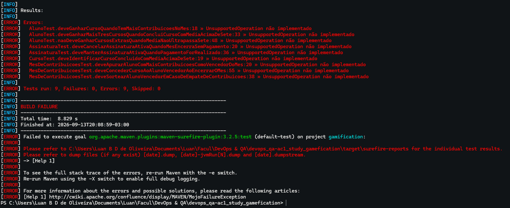
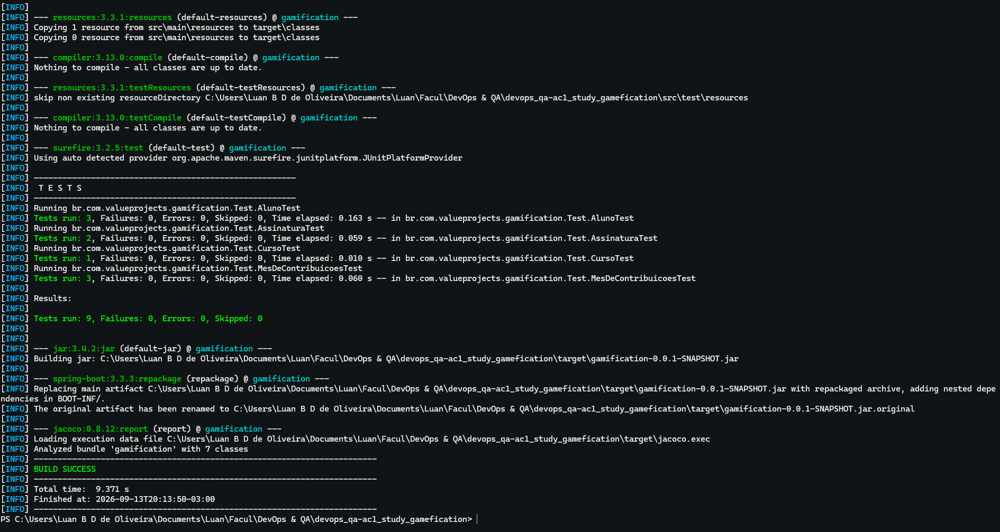
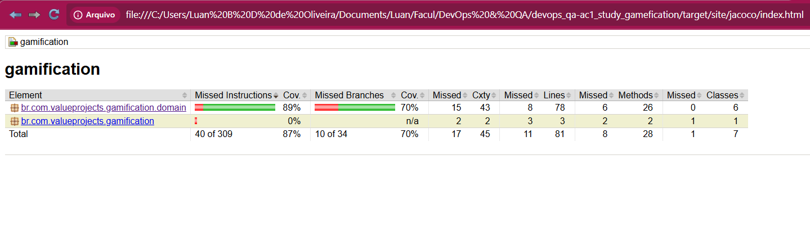
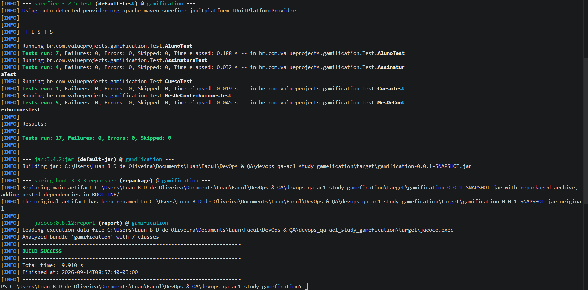
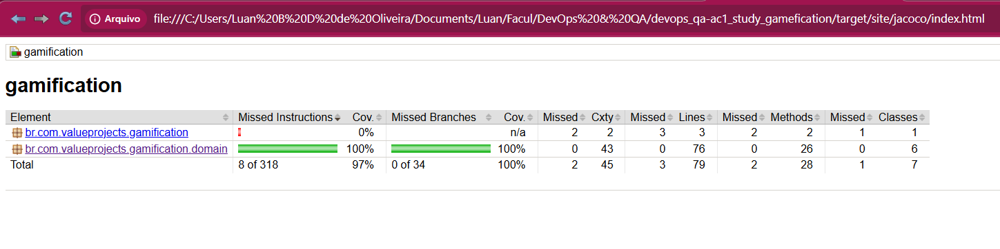
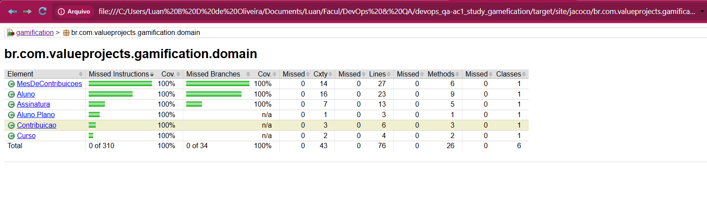
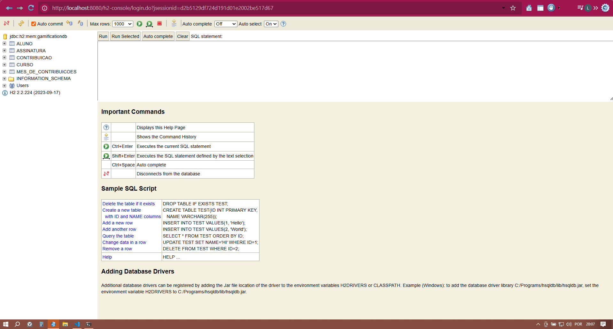
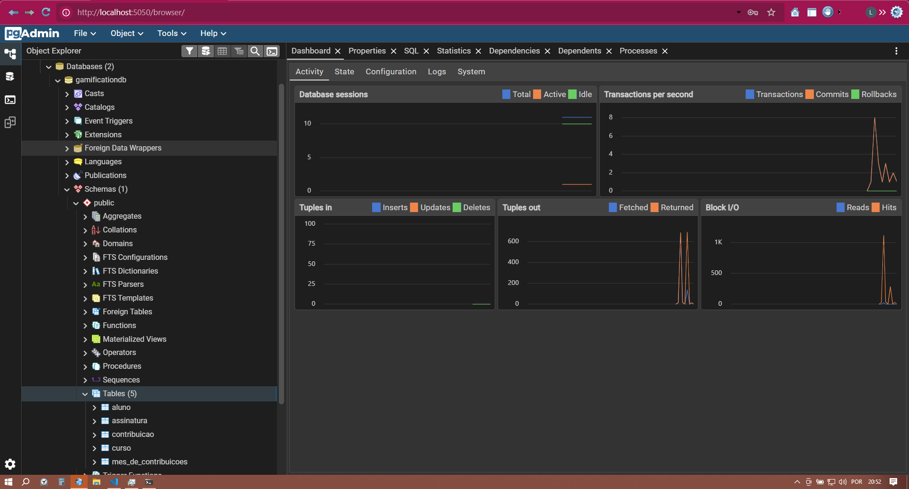

# Gamification — AC1 DevOps & QA

Projeto da disciplina **DevOps & QA** (Engenharia de Computação), desenvolvido em ciclo **TDD (RED → GREEN → BLUE)** a partir de cenários BDD, com API REST em Spring Boot, persistência em PostgreSQL e orquestração via Docker Compose.

**Integrante do grupo:**

- Caio Menna Ribeiro, RA: 235301
- Juan Pedro Jerônimo Guilen, RA: 200679.
- Luan Bruno Domingues de Oliveira, RA: 210200.


## Estudo de caso — Gamificação para Engajamento de Educação Continuada

Uma plataforma vende cursos online e EAD no modelo de assinaturas. O aluno paga uma mensalidade e tem acesso a um conjunto de cursos do plano básico. A cada curso concluído com média acima de 7,0, o aluno ganha o direito de realizar mais 3 cursos. O aluno que mais escrever tópicos no fórum e ajudar outros participantes com seus comentários ganha um curso extra ao final do mês (em caso de empate, o vencedor é sorteado). Ao acumular 12 cursos, o plano do aluno passa a ser **Premium**, com voucher para participar de projetos reais durante os cursos e recebimento de 3 moedas, conversíveis em novos cursos, acumuláveis ou resgatáveis em criptomoeda.

## User Stories

User stories elaboradas. (As duas primeiras US foram elaboradas por Luan Bruno, e as duas últimas por Juan Pedro)

| Autor | ID | Persona   | Como...                          | Eu quero...                                             | Para que...                                          |
|-------|----|-----------|-----------------------------------|----------------------------------------------------------|--------------------------------------------------------|
| Luan  | 1  | ADM       | aluno curioso e esforçado         | ser recompensado pela contribuição em discussões          | adquirir mais cursos e ampliar meu conhecimento         |
| Luan  | 2  | ALUNO     | aluno de cursos                   | participar e contribuir com outros alunos                 | ajudar a compartilhar o conhecimento                    |
| Juan  | 3  | PROFESSOR | professor de curso online         | uma plataforma que reúna uma comunidade                    | melhorar a qualidade da experiência do curso            |
| Juan  | 4  | ADM       | dono da plataforma                | conectar mais alunos com mais professores                  | criar uma forte comunidade                              |

### US escolhida para desenvolvimento

**US #1** — *"Como aluno curioso e esforçado, quero ser recompensado pela contribuição em discussões, para adquirir mais cursos e ampliar meu conhecimento."*

Foi escolhida por concentrar a regra de negócio mais rica do case (apuração mensal de contribuições, critério de desempate, ganho de cursos, vínculo com assinatura/pagamento e conclusão de cursos com bônus de créditos), permitindo cobrir com profundidade o ciclo TDD e a modelagem de domínio, diferente das demais US, que são mais descritivas/qualitativas (comunidade, integração aluno-professor).

## Cenários BDD

Cenários elaborados, derivados da US #1.

**Cenário 1 — Aluno com mais contribuições ganha um curso**
- Autor: Luan
- **Given** o aluno com mais contribuições
- **When** encerra o mês
- **Then** o aluno ganha um curso

**Cenário 2 — Mensalidade não paga cancela a assinatura**
- Autor: Juan
- **Given** uma mensalidade não paga
- **And** o aluno está ativo
- **When** encerra o mês
- **And** não é realizado o pagamento
- **Then** a assinatura do aluno é cancelada

**Cenário 3 — Empate em contribuições é resolvido por sorteio**
- Autor: Luan
- **Given** um empate em contribuições de alunos
- **When** o mês encerra
- **Then** o aluno vencedor do mês é sorteado

**Cenário 4 — Conclusão de curso com média acima de 7 concede cursos bônus**
- Autor: Juan
- **Given** um aluno que finalizou um curso
- **And** está com a média acima de 7
- **When** finalizar o curso
- **Then** esse aluno ganhará mais 3 cursos

## Stack técnica

- **Java 17**
- **Spring Boot 3.3.3** (`spring-boot-starter-web`, `spring-boot-starter-data-jpa`)
- **Maven** (build e gerenciamento de dependências)
- **JUnit 5** (Jupiter, via `spring-boot-starter-test`) — testes unitários de domínio e de service, escritos no estilo Given/When/Then dos cenários BDD
- **JaCoCo 0.8.12** — cobertura de testes (100% nas classes de `domain` e 79% de cobertura total)
- **H2** — banco em memória, perfil de apoio didático/local
- **PostgreSQL 16** — banco relacional, perfil padrão de execução
- **Docker / Docker Compose** — containerização da aplicação e orquestração com PostgreSQL e pgAdmin

## Arquitetura

Pacotes em `br.com.valueprojects.gamification`:

- `domain` — regras de negócio puras (`Aluno`, `Contribuicao`, `MesDeContribuicoes`, `Assinatura`, `Curso`), 100% cobertas por testes (fase BLUE do TDD)
- `entity` — entidades JPA persistidas no banco
- `repository` — interfaces `JpaRepository`
- `service` — orquestra repositório + regras de `domain`
- `dto` — objetos de requisição/resposta da API
- `controller` — endpoints REST

### Endpoints principais

| Método | Endpoint                                    | Descrição                                  |
|--------|----------------------------------------------|---------------------------------------------|
| GET    | `/api/alunos`                                 | Lista os alunos                              |
| GET    | `/api/alunos/{nome}`                          | Consulta um aluno                            |
| POST   | `/api/alunos/{alunoNome}/cursos`               | Registra conclusão de curso pelo aluno       |
| POST   | `/api/assinaturas/{alunoNome}`                 | Cria assinatura do aluno                     |
| GET    | `/api/assinaturas/{alunoNome}`                 | Consulta assinatura do aluno                 |
| POST   | `/api/assinaturas/{alunoNome}/pagamento`       | Registra pagamento da mensalidade            |
| POST   | `/api/assinaturas/{alunoNome}/encerrar`        | Encerra/cancela a assinatura                 |
| POST   | `/api/meses/{descricao}/contribuicoes`         | Registra contribuição do aluno no mês        |
| GET    | `/api/meses/{descricao}/ranking`               | Consulta ranking de contribuições do mês     |
| POST   | `/api/meses/{descricao}/encerrar`              | Apura o vencedor do mês (com sorteio em empate) |

## Como rodar os testes com cobertura

```bash
# roda os testes unitários (domain + service)
mvn test

# roda os testes e gera o relatório JaCoCo
mvn verify
```

O relatório de cobertura fica em `target/site/jacoco/index.html` (abrir no navegador).

## Como rodar localmente (sem Docker)

### Opção A — perfil padrão (H2, em memória)

```bash
mvn spring-boot:run
```

- Aplicação: `http://localhost:8080`
- Console H2: `http://localhost:8080/h2-console`
  - JDBC URL: `jdbc:h2:mem:gamificationdb`
  - Usuário: `sa` / Senha: (em branco)

### Opção B — perfil PostgreSQL (banco local ou via Docker standalone)

```bash
mvn spring-boot:run -Dspring-boot.run.profiles=postgres
```

Variáveis de ambiente aceitas (com valores padrão): `DB_HOST` (`localhost`), `DB_PORT` (`5432`), `DB_NAME` (`gamificationdb`), `DB_USER` (`postgres`), `DB_PASSWORD` (`postgres`).

## Como rodar via Docker Compose

Na raiz do projeto:

```bash
docker compose up --build
```

Isso sobe 3 serviços:

- **app** — API Spring Boot em `http://localhost:8080` (perfil `postgres` ativo)
- **postgres** — PostgreSQL 16 em `localhost:5432`
- **pgadmin** — pgAdmin em `http://localhost:5050`

### Dados do PostgreSQL (Docker Compose)

- Banco: `gamificationdb`
- Usuário: `postgres`
- Senha: `postgres`
- Porta: `5432`

### Acesso ao pgAdmin

- URL: `http://localhost:5050`
- Login: `admin@admin.com` / Senha: `admin`

Ao cadastrar o servidor no pgAdmin, use:

- Host: `postgres` (nome do serviço no Compose — não usar `localhost`)
- Port: `5432`
- Maintenance database: `gamificationdb`
- Username: `postgres`
- Password: `postgres`

Para encerrar e remover os volumes:

```bash
docker compose down -v
```

## Evidências

Prints coletados durante o ciclo TDD e a validação dos bancos H2/PostgreSQL.

### RED — testes de domínio falhando (camada domain)



### GREEN — testes passando (camada domain)




### BLUE — refino e cobertura (camada domain)





### Bancos H2 e PostgreSQL



